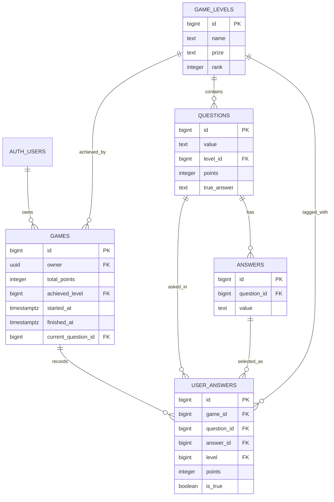

# Caesar Numerus

Caesar Numerus is a Roman-themed, mathematics-focused game show web app inspired by *Who Wants to Be a Millionaire?*. Players sign up or log in, update their profile, start new games, continue active rounds, inspect past games, and remove games they no longer want to keep. The experience is designed for authenticated users who want to play through progressively harder math challenges in a stylized ancient Roman arena.

## Project Overview

This project is a single-page web application built with Vite, vanilla JavaScript, Bootstrap 5, and Supabase.

What users can do:

- Create an account or log in.
- Set a nickname and upload a profile avatar.
- Start a new game and continue playing from the play screen.
- View all games in a table with date, achieved level, prize, and duration.
- Open a game to review its details or resume play.
- Delete a game with confirmation.
- Log out and return to the home page.

## Architecture

### Front End

- Vite powers the build and development workflow.
- Vanilla JavaScript is used for routing, rendering, and interaction logic.
- Bootstrap 5 provides layout, components, and responsive behavior.
- Bootstrap Icons are used for the Roman/game-show visual language.
- The UI is organized as routed page modules with shared header and footer components.

### Back End / Services

- Supabase Auth handles user registration, login, and session management.
- Supabase Database stores levels, questions, games, and answers.
- Supabase Storage stores user avatar images in a public `avatars` bucket.
- Row Level Security policies keep game data and avatar files tied to the signed-in user.

### Technologies Used

- Vite
- JavaScript (ES modules)
- Bootstrap 5
- Bootstrap Icons
- Supabase JS client
- Supabase Auth
- Supabase Postgres
- Supabase Storage

## Database Schema Design

Main tables and relationships:



### How the data works

- `game_levels` defines the challenge ladder and its prize tiers.
- `questions` belongs to a level and stores the prompt, point value, and true answer.
- `answers` stores the four answer options for each question.
- `games` stores each user’s match progress, points, level progress, and timestamps.
- `user_answers` stores the player’s submitted responses for a specific game.
- Supabase Auth manages the user identity, so there is no custom users table.

## Local Development Setup Guide

### 1. Install dependencies

```bash
cd app
npm install
```

### 2. Configure environment variables

Create an `app/.env` file with the public Supabase values used by the browser app:

```env
VITE_SUPABASE_URL=your_supabase_project_url
VITE_SUPABASE_ANON_KEY=your_supabase_anon_key
```

If you want to run the seed script, also add the service-role values used by `scripts/seed.js`:

```env
SUPABASE_URL=your_supabase_project_url
SUPABASE_SERVICE_ROLE_KEY=your_supabase_service_role_key
```

### 3. Run the app

```bash
npm run dev
```

### 4. Build for production

```bash
npm run build
```

### 5. Seed the database

The repository includes a seed script for levels, questions, and answers:

```bash
npm run seed
```

### 6. Apply Supabase migrations

The SQL migrations live in `app/supabase/migrations/`. Apply them to your Supabase project before testing auth, games, and storage features.

## Key Folders and Files

### `app/src/main.js`
Bootstraps the app shell, shared background effects, and router mounting.

### `app/src/router.js`
Client-side router with route protection and navigation handling.

### `app/src/lib/auth.js`
Supabase auth helper functions for login, register, logout, session lookup, profile updates, and avatar uploads.

### `app/src/lib/games.js`
Game-related data helpers for listing games, creating a new game, loading game details, saving answers, and deleting games.

### `app/src/components/header/`
Shared top navigation, including auth-aware links and logout action.

### `app/src/components/footer/`
Shared footer content and styling.

### `app/src/pages/home/`
Landing page with the Roman mathematics game-show hero.

### `app/src/pages/login/`
Register/login screen.

### `app/src/pages/profile/`
Profile page for nickname and avatar management.

### `app/src/pages/games/`
Games table page with view, play, and delete actions.

### `app/src/pages/game-start/`
Creates a new game and redirects into play mode.

### `app/src/pages/game-play/`
Interactive question play screen.

### `app/src/pages/game-view/`
Game overview screen with resume and delete actions.

### `app/src/pages/dashboard/`
Dashboard landing page for authenticated users.

### `app/src/pages/game-detail/`
Older dynamic game route kept for compatibility.

### `app/src/styles/app.css`
Global design system, theme, typography, and animated background effects.

### `app/supabase/migrations/`
Database schema, RLS policies, and storage bucket policies.

## Notes

- The app expects authenticated users for game and profile features.
- Avatar uploads are limited to 500kb in the profile UI.
- The `avatars` storage bucket is public for display, but uploads and deletes are restricted to the owning user.
